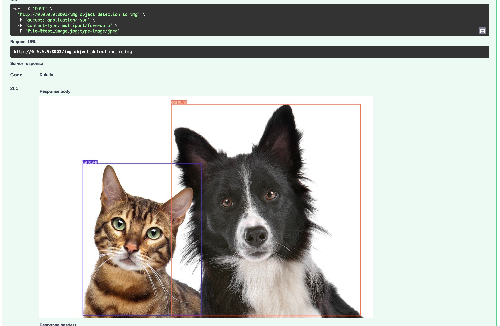
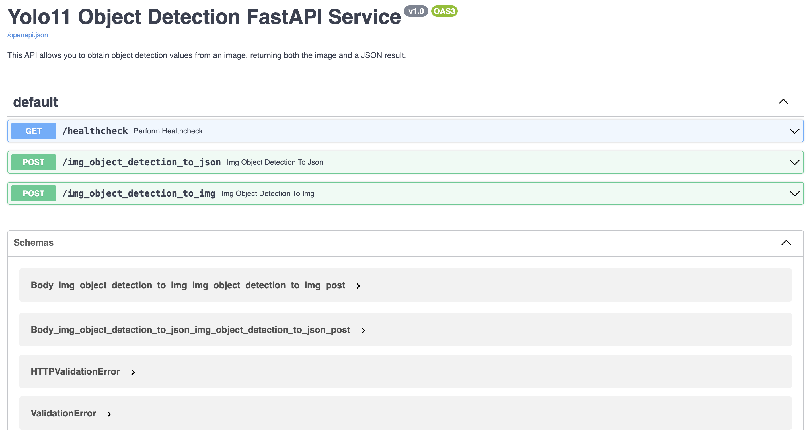

# YOLO11-FastAPI
</a>

This repository serves a simple object detection service using Ultralytics and FastAPI. With the help of YOLO11, you can detect the objects on the images/frames and with the help of FastAPI, you can create a modern, fast (high-performance) web framework for building APIs. This project also includes Docker, a platform for easily building, shipping, and running distributed applications.

### Sample
Here's a sample of what you can expect to see with this project:

</a>

# What's inside:

- YOLO11: A popular real-time object detection model which is designed to be fast, accurate, and easy to use, making it an excellent choice for a wide range of object detection and tracking, instance segmentation, image classification and pose estimation tasks.
- FastAPI: A modern, fast (high-performance) web framework for building APIs
- Docker: A platform for easily building, shipping, and running distributed applications

</a>

---
# Getting Started

You have two options to start the application: using Docker or locally on your machine.

## Using Docker
Start the application with the following command:
```
docker-compose up
```

## Locally
To start the application locally, follow these steps:

1. Install the required packages:
```
pip install -r requirements.txt
```

2. Start the application:

```
uvicorn main:app --reload --host 0.0.0.0 --port 8003
```  
**Note:** You can change the address and port in the file **docker-compose.yaml**

## FAST API Docs url:
http://0.0.0.0:8003/docs#/

    

Ready to start your object detection journey with YOLO11-FastAPI? 🚀

---

# 🚀 Code Examples
### Example 1: Object Detection to JSON   
The following code demonstrates how to perform object detection and receive the results in JSON format:

```python
import requests

input_image_name = 'data/test_image.jpg'
api_host = 'http://0.0.0.0:8003/'
type_rq = 'img_object_detection_to_json'

files = {'file': open(input_image_name, 'rb')}

response = requests.post(api_host+type_rq, files=files)

data = response.json()     
print(data)
```

Output:
```
{'detect_objects': [{'name': 'cat', 'confidence': 0.926225245}, {'name': 'dog', 'confidence': 0.9109069705}], 'detect_objects_names': 'cat, dog'}
```

### Example 2: Object Detection to Image    
The following code demonstrates how to perform object detection and receive the results in image format.

```python
import requests
from PIL import Image
from io import BytesIO
import matplotlib.pyplot as plt

input_image_name = 'data/test_image.jpg'
api_host = 'http://0.0.0.0:8003/'
type_rq = 'img_object_detection_to_img'

files = {'file': open(input_image_name, 'rb')}

response = requests.post(api_host+type_rq, files=files)

img = Image.open(BytesIO(response.content)) 
plt.imshow(img)
```

---

# Folder Tree and Overview Of The Code

```bash
yolo11-fastapi/
├── data/
│   ├── swagger.json
│   └── test_image.jpg
├── model/
│   ├── __init__.py
│   └── detector.py
├── utils/
│   ├── __init__.py
│   ├── data_processor.py
│   ├── image_processor.py
│   ├── logger.py
│   └── visualizer.py
├── weights/
│   └── yolo11<version>.pt
├── app.py
├── Dockerfile
├── docker-compose.yaml
└── requirements.txt
```

* [app.py](./app.py) - Base FastAPI functions
* [model/detector.py](./model/detector.py) - Yolo11 functions
* [utils/data_processor.py](./models) - Dataframe functions
* [utils/image_processor.py](./models) - Image/Byte operations
* [utils/visualizer.py](./models) - BBox drawing opeartion  
* [utils/logger.py](./models) - Logging functions
